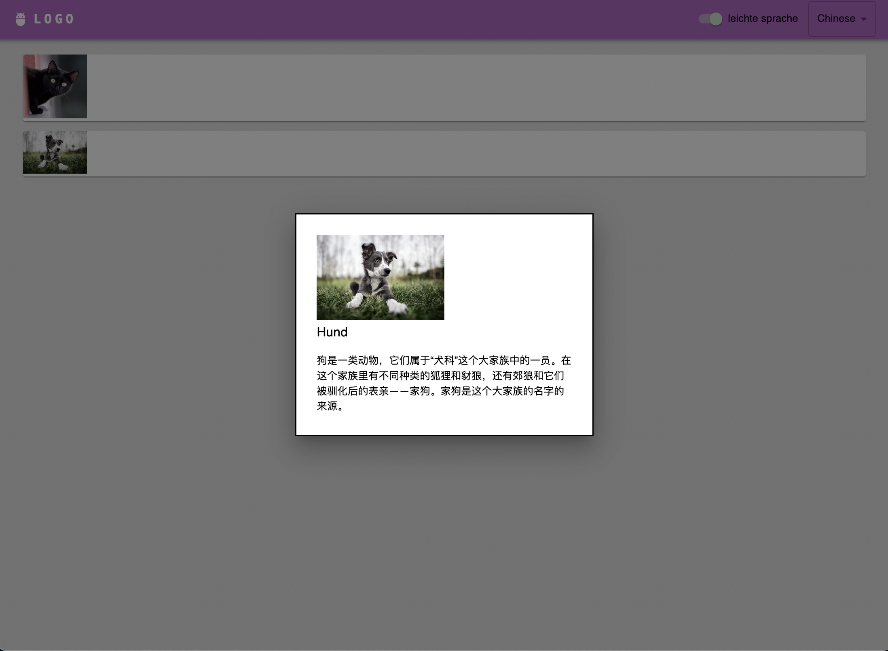

# Demo: how to use LLMs to translate and simplify any text
this is a simple demo made for a museum and llm event.
it uses a dataset in german language and translates it into any language, it additionally simplifies the text.

## server
that is the part the talks to openai and caches the answers (for now only in memory).

## app
that is the user-facing part, in this case a simple web app, but could be a mobile or desktop app.
